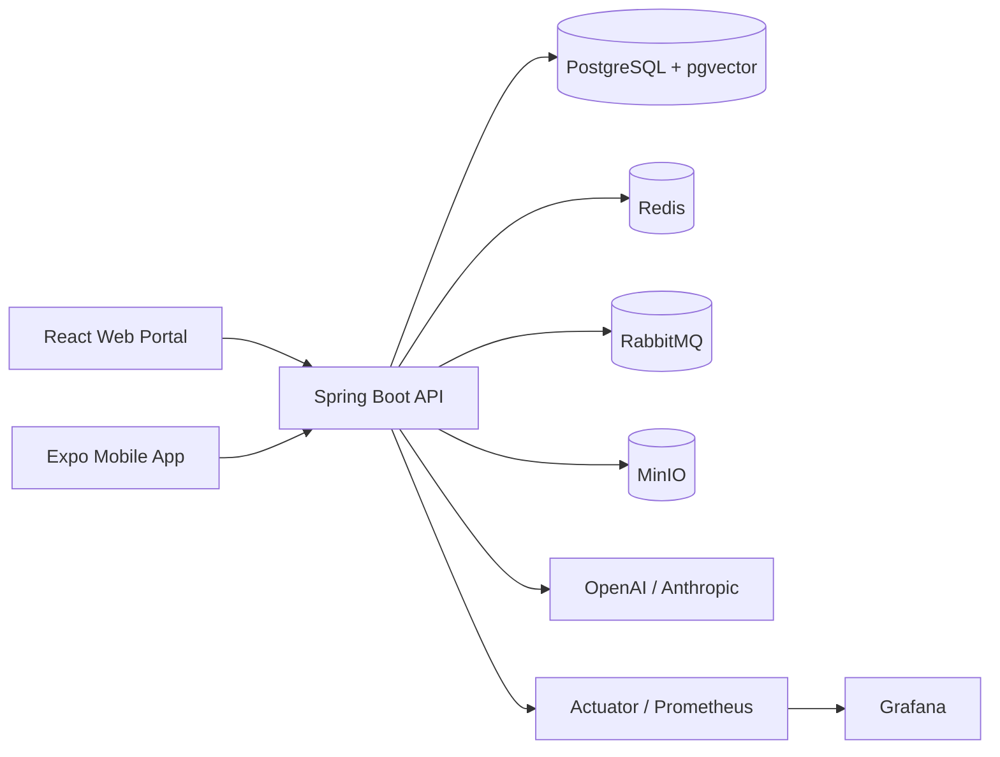

# CloudCampus

Enterprise digital school SaaS with a multi-tenant Spring Boot backend, React web portal, Expo Android/iOS/web mobile app, PostgreSQL/pgvector database, Redis, RabbitMQ, MinIO, and production-oriented observability.

## Current Stack

| Layer | Technology |
|---|---|
| Backend | Java 21, Spring Boot 3.5.14, Spring Security, Spring Data JPA, Flyway |
| AI | Spring AI 1.0.7, Anthropic chat, OpenAI embeddings, pgvector |
| Database | PostgreSQL 16 with pgvector, Flyway migrations through `V93` |
| Cache/queue/storage | Redis 7, RabbitMQ, MinIO |
| Web frontend | React 19, TypeScript, Vite, React Router, TanStack Query, Zustand |
| Mobile | Expo 52, React Native 0.76, Android/iOS/web, Axios, secure session storage |
| Observability | Actuator, Micrometer, Prometheus, Grafana, Tempo/OpenTelemetry |
| CI/CD | GitHub Actions for backend verify, frontend build, secret scan, security scans, Docker publish, OpenAPI publish |

## Project Layout

```text
CloudCampus/
├── backend/              # Spring Boot API
├── frontend/             # React/Vite web app
├── mobile/               # Expo mobile app for Android, iOS, and web
├── infra/                # nginx, Prometheus, Grafana, Tempo, backup, load tests
├── docs/                 # Enterprise documentation system
├── docker-compose.yml    # Local development infrastructure
└── README.md
```

## Documentation

The permanent documentation system is under [docs](docs/README.md).

Start here:
- [Project overview](docs/00-core/PROJECT_OVERVIEW.md)
- [System architecture](docs/00-core/SYSTEM_ARCHITECTURE.md)
- [Agent instructions](docs/00-core/AGENT_INSTRUCTIONS.md)
- [Do-not-break rules](docs/00-core/DO_NOT_BREAK_RULES.md)
- [Mobile architecture](docs/03-mobile/MOBILE_ARCHITECTURE.md)
- [CI/CD pipeline](docs/05-devops/CI_CD_PIPELINE.md)

## Architecture Summary



Core safety boundaries:
- Tenant identity comes from JWT/request context, not client-provided IDs.
- Tenant-owned repositories must query by `tenantId`.
- Backend RBAC is authoritative; frontend/mobile role rendering is UX only.
- Mutations must validate role, tenant ownership, business state, and audit requirements.
- Student academic/lifecycle history must not be overwritten.

## Local Setup

### Prerequisites

- Java 21
- Maven 3.9+
- Node 20 / npm 10+
- Docker + Docker Compose
- Expo Go on Android/iOS for device testing
- Android Studio/ADB only if you want automatic emulator install/run

### 1. Start Infrastructure

```bash
docker compose up -d
```

Useful local services:

| Service | URL |
|---|---|
| Backend API | http://localhost:8080 |
| Health | http://localhost:8080/actuator/health |
| Swagger UI | http://localhost:8080/swagger-ui.html |
| Web frontend | http://localhost:5173 |
| Mobile web/Metro | http://localhost:8081 |
| MailHog | http://localhost:8025 |
| MinIO console | http://localhost:9001 |
| Prometheus | http://localhost:9090 |
| Grafana | http://localhost:3100 |

### 2. Run Backend

```bash
cd backend
mvn spring-boot:run -Dspring-boot.run.profiles=dev
```

CI-equivalent backend validation:

```bash
cd backend
mvn verify --batch-mode --no-transfer-progress
```

### 3. Run Web Frontend

```bash
cd frontend
npm ci
npm run dev
```

CI-equivalent frontend validation:

```bash
cd frontend
npm run build
```

### 4. Run Mobile

```bash
cd mobile
npm install
npm run typecheck
npx expo start --host lan --clear
```

Android/Expo Go:
- Metro URL: `exp://10.89.241.90:8081`
- Android API base URL: `http://10.89.241.90:8080`
- Configured in [mobile/app.json](mobile/app.json) as `extra.apiBaseUrlAndroid`.

Web preview:

```bash
cd mobile
npm run web
```

Android bundle validation:

```bash
cd mobile
npx expo export --platform android
```

## Demo Logins

Use tenant `jnv-lucknow-demo` unless noted.

| Role | Username | Password |
|---|---|---|
| School admin | `jnv.admin` | `Demo@1234` |
| Teacher | `jnv.teacher001` | `Demo@1234` |
| Student | `jnv.student001` | `Demo@1234` |
| Parent | `jnv.parent001` | `Demo@1234` |

Super-admin login is platform-scoped; leave tenant blank if the client supports it.

## Mobile App Status

The mobile app is active in this repository. It provides:
- JWT login, refresh-token rotation, logout, and secure/native session storage.
- Android-specific API base URL resolution.
- Role-aware dashboard for `SCHOOL_ADMIN`, `TEACHER`, `STUDENT`, and `PARENT`.
- School switching through `/v1/me/schools/{schoolId}/activate`.
- Live API sync cards for current backend read endpoints.

Mobile API smoke was validated locally across school admin, teacher, student, and parent roles with `33` checks passing and `0` failures.

## CI/CD

Required CI checks:
- Backend: `cd backend && mvn verify --batch-mode --no-transfer-progress`
- Frontend: `cd frontend && npm ci && npm run build`
- Secret scan: TruffleHog

Security and release workflows:
- `security-nightly.yml`: OWASP Dependency Check and Trivy scans.
- `docker-publish.yml`: GHCR backend/frontend images on `main`, `release/**`, tags, or manual dispatch.
- `openapi-publish.yml`: generates and publishes `/v3/api-docs`.

Current CI note: the workflow still does not run mobile validation even though mobile is active again. Treat this as a known follow-up: add `cd mobile && npm ci && npm run typecheck && npx expo export --platform android` to CI when mobile becomes release-blocking.

## Validation Commands

```bash
cd backend && mvn verify --batch-mode --no-transfer-progress
cd frontend && npm run build
cd mobile && npm run typecheck
cd mobile && npx expo export --platform android
cd mobile && npx expo export --platform web
```

## Security Rules

- Never bypass tenant isolation.
- Never trust tenant/school ids from the client without backend ownership checks.
- Never expose tokens, OTPs, payment secrets, AI keys, or raw sensitive PII in logs.
- Never disable tests, RBAC, Flyway validation, secret scanning, OWASP, or Trivy to make builds pass.
- Every new mutation must include validation, RBAC, tenant safety, and audit logging.

See [docs/00-core/DO_NOT_BREAK_RULES.md](docs/00-core/DO_NOT_BREAK_RULES.md) for the full rules.
