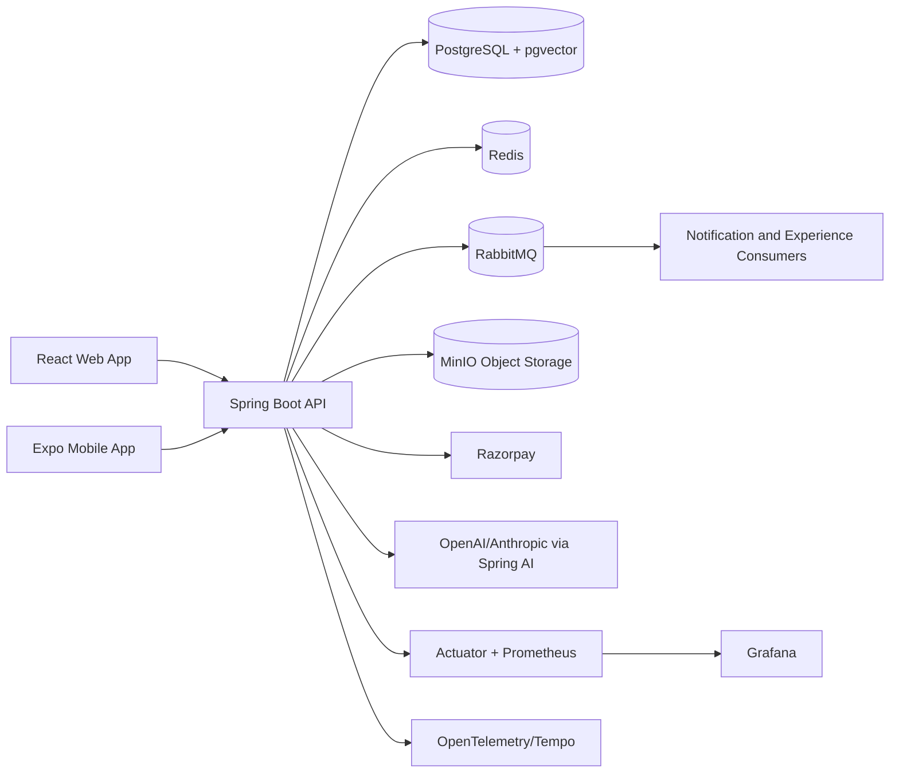
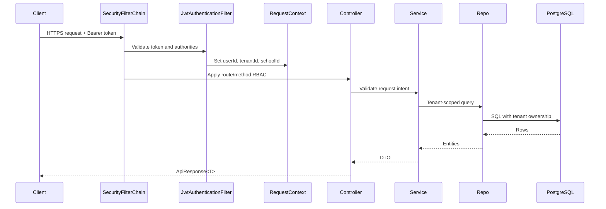

# System Architecture

## High-Level Topology

## Request Flow

## Architectural Boundaries
- Backend controllers are thin and role-aware; services own business rules and cross-entity validation.
- Repositories must preserve tenant ownership in every read/write path.
- Frontend route guards improve UX but never replace backend RBAC.
- Mobile uses the same backend API contract as web and stores sessions through secure storage/localStorage fallback.
- Async work uses named executors or RabbitMQ; async code must preserve `RequestContext` when tenant data is touched.
