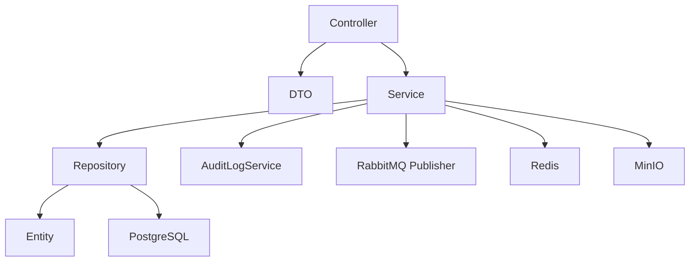

# Backend Architecture

CloudCampus backend is a Java 21 Spring Boot application organized by business package under `com.cloudcampus`.

## Main Technologies
- Spring Web, Validation, Security, AOP, Cache, Mail, Actuator.
- Spring Data JPA with PostgreSQL and Flyway.
- Redis for rate limits, OTPs, JWT denylist, feature cache, QR attendance tokens, and tenant suspension cache.
- RabbitMQ for notification and experience analytics queues.
- MinIO for object storage.
- Spring AI for Anthropic chat, OpenAI embeddings, and pgvector vector store.
- Micrometer, Prometheus, OpenTelemetry, Tempo, Grafana for observability.

## Layering

## Package Inventory
| Package | Controllers | Services | Repositories | `@PreAuthorize` count |
|---|---:|---:|---:|---:|
| `ai` | 4 | 3 | 3 | 3 |
| `assignment` | 3 | 1 | 2 | 3 |
| `attendance` | 2 | 2 | 2 | 0 |
| `audit` | 0 | 0 | 1 | 0 |
| `auth` | 2 | 3 | 2 | 4 |
| `domain` | 1 | 1 | 1 | 8 |
| `exam` | 3 | 3 | 4 | 3 |
| `experience` | 5 | 0 | 24 | 0 |
| `feature` | 1 | 1 | 2 | 0 |
| `finance` | 1 | 1 | 4 | 0 |
| `homework` | 3 | 1 | 2 | 3 |
| `leave` | 2 | 0 | 1 | 2 |
| `lessonplan` | 1 | 1 | 1 | 6 |
| `mobile` | 2 | 1 | 0 | 1 |
| `notice` | 1 | 1 | 1 | 1 |
| `notification` | 2 | 3 | 2 | 1 |
| `onlineclass` | 1 | 1 | 1 | 7 |
| `payment` | 1 | 1 | 1 | 3 |
| `reports` | 3 | 2 | 0 | 3 |
| `school` | 8 | 7 | 8 | 6 |
| `staff` | 2 | 2 | 1 | 0 |
| `staffattendance` | 1 | 0 | 1 | 1 |
| `storage` | 1 | 0 | 1 | 2 |
| `student` | 8 | 4 | 10 | 5 |
| `subscription` | 3 | 1 | 1 | 3 |
| `teacher` | 2 | 0 | 0 | 2 |
| `tenant` | 3 | 4 | 2 | 0 |
| `timetable` | 3 | 1 | 1 | 3 |
| `video` | 1 | 1 | 1 | 7 |
| `website` | 2 | 1 | 4 | 1 |
| `whatsapp` | 1 | 1 | 1 | 1 |

## Critical Backend Constraints
- Auth and RBAC are enforced by `SecurityConfig`, `JwtAuthenticationFilter`, and controller-level `@PreAuthorize`.
- Tenant context is set from JWT and read through `RequestContext`.
- Tenant-owned repositories must include tenant predicates.
- Async services must use configured executors so request context can be propagated when needed.
