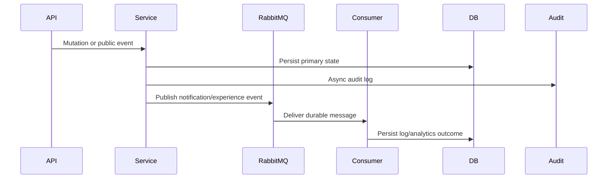

# Event Flow

## Event Sources
- Attendance absence detection queues parent alerts through notification queue publisher.
- Website/experience public analytics publish experience events.
- Upload flows write upload audit events.
- Auth and profile flows write audit events asynchronously.
- Payment webhooks update payment/order state and must remain idempotent.

## Event Diagram

## Rules
- Publish events only after validating tenant ownership and state transition.
- Include tenant/school ids in event payloads for consumers.
- Consumers must be idempotent where retry can duplicate delivery.
- Dead-letter queues are mandatory for durable Rabbit flows.
