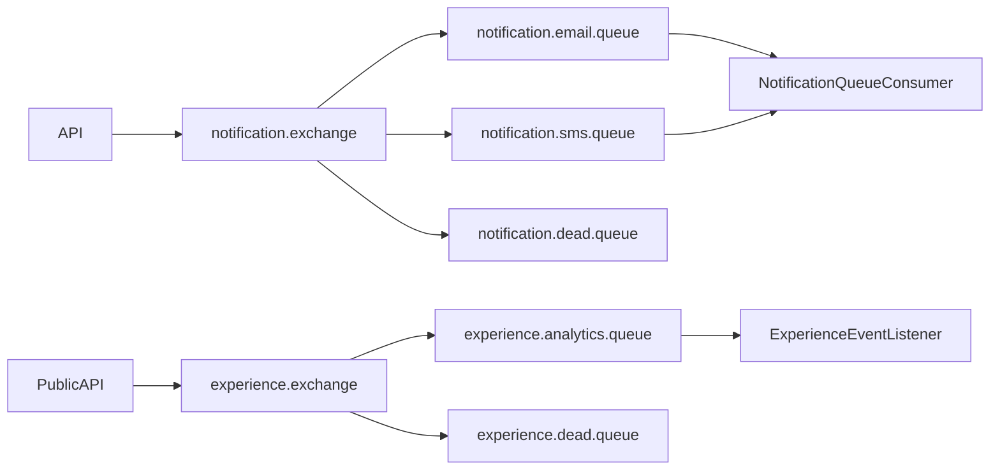

# Queue Architecture

## RabbitMQ Queues
- Notification exchange handles email and SMS routing keys with a dead-letter queue.
- Experience exchange handles public experience analytics events with dead-letter routing.
- Notification queue config is active outside test profile to avoid broker startup failures in tests.

## Rules
- Messages must carry tenant and school identifiers where applicable.
- Consumers must not trust payload tenant if the related entity lookup fails tenant ownership.
- Do not block request threads on external notification dispatch.
- Queue failures should degrade notification delivery, not corrupt primary academic/finance state.
