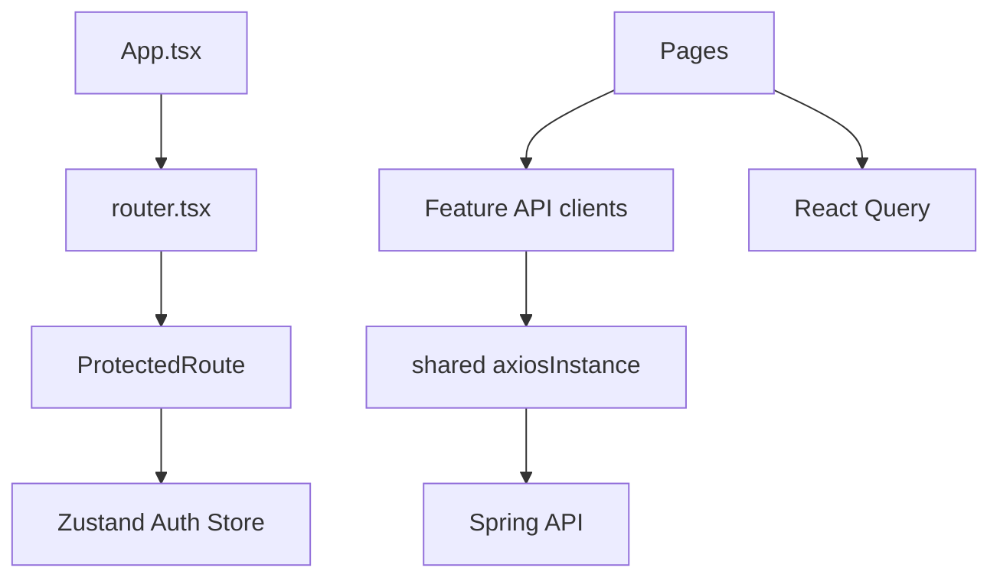

# Frontend Architecture

The web frontend is a Vite/React TypeScript app under `frontend/src`.

## Detected Feature Folders
- `assignments`
- `attendance`
- `auth`
- `exam`
- `exams`
- `experience`
- `finance`
- `homework`
- `notice-board`
- `notification`
- `parent`
- `public-site`
- `reports`
- `role-portals`
- `school-admin`
- `staff`
- `student`
- `super-admin`
- `teacher`
- `tenant`
- `timetable`
- `whatsapp`

## Main Libraries
- React 19 and React DOM.
- React Router 7 for routing.
- React Query for server state.
- Zustand for auth and experience state.
- Axios for API calls.
- Zod and React Hook Form for form validation.
- Shared UI components under `frontend/src/shared/ui`.

## Architecture

