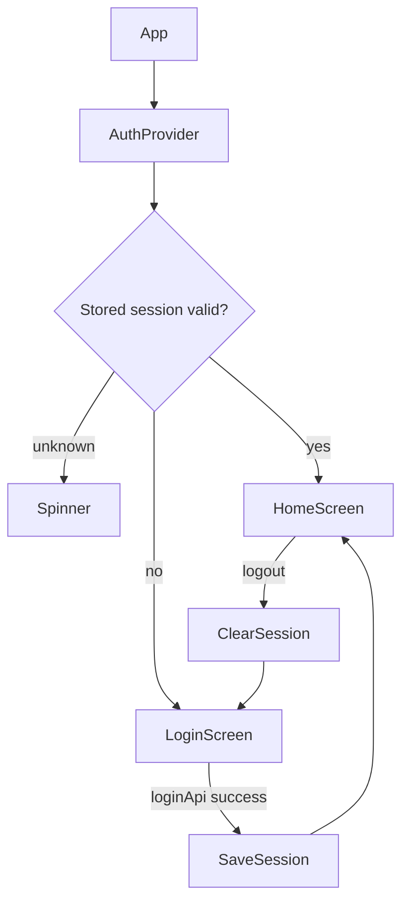

# Mobile Navigation Flow

## Current State
Navigation is intentionally simple: authenticated users land on one role-aware dashboard rather than a multi-tab native shell. The dashboard calls role-specific backend read APIs and shows live sync cards for the current role.

## School Switching
For users with multiple school grants, `HomeScreen` lists `/v1/me/schools` and switches active school through `/v1/me/schools/{schoolId}/activate`. The backend returns a new access token scoped to the selected school; the refresh token remains unchanged.
