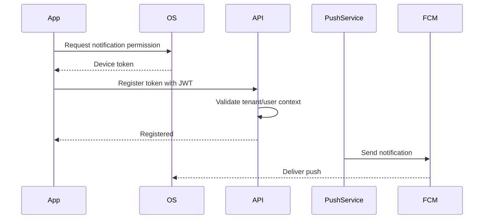

# Push Notification Flow

## Backend Support Detected
- Firebase Admin SDK dependency exists.
- Device token endpoints and repositories exist in notification/auth areas.
- Push dispatch is asynchronous through notification services.

## Expected Mobile Flow

## Rules
- Device tokens are user and tenant scoped.
- Logout should revoke or deactivate the token where supported.
- Push payloads must avoid sensitive PII.
