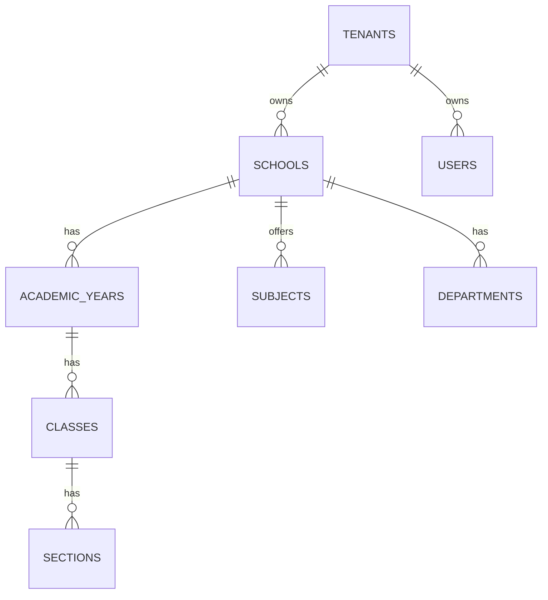
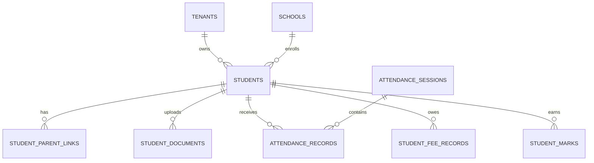
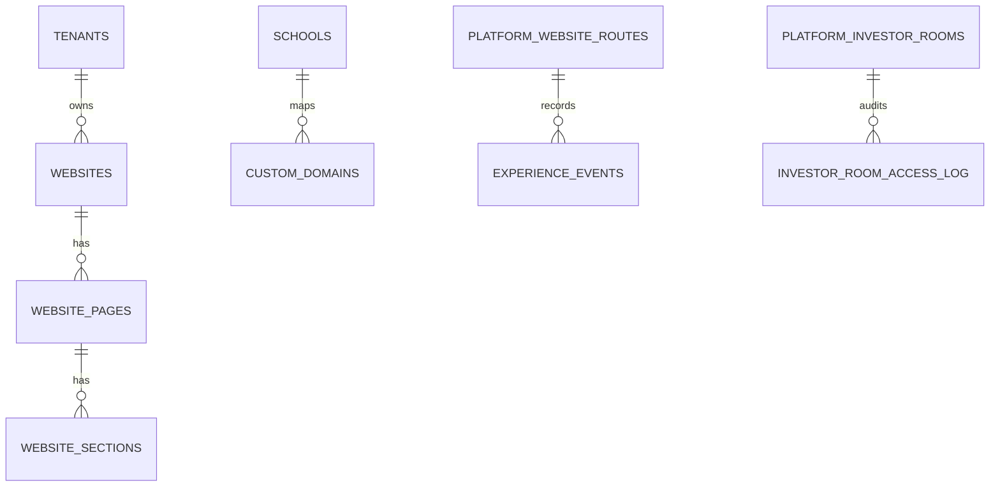

# ER Diagrams

## Core Tenant/School/Academic Model

```mermaid
erDiagram
  TENANTS ||--o{ SCHOOLS : owns
  TENANTS ||--o{ USERS : owns
  SCHOOLS ||--o{ ACADEMIC_YEARS : has
  ACADEMIC_YEARS ||--o{ CLASSES : has
  CLASSES ||--o{ SECTIONS : has
  SCHOOLS ||--o{ SUBJECTS : offers
  SCHOOLS ||--o{ DEPARTMENTS : has
```

## Student Operations

```mermaid
erDiagram
  TENANTS ||--o{ STUDENTS : owns
  SCHOOLS ||--o{ STUDENTS : enrolls
  STUDENTS ||--o{ STUDENT_PARENT_LINKS : has
  STUDENTS ||--o{ STUDENT_DOCUMENTS : uploads
  STUDENTS ||--o{ ATTENDANCE_RECORDS : receives
  ATTENDANCE_SESSIONS ||--o{ ATTENDANCE_RECORDS : contains
  STUDENTS ||--o{ STUDENT_FEE_RECORDS : owes
  STUDENTS ||--o{ STUDENT_MARKS : earns
```

## Website/Experience

```mermaid
erDiagram
  TENANTS ||--o{ WEBSITES : owns
  WEBSITES ||--o{ WEBSITE_PAGES : has
  WEBSITE_PAGES ||--o{ WEBSITE_SECTIONS : has
  SCHOOLS ||--o{ CUSTOM_DOMAINS : maps
  PLATFORM_WEBSITE_ROUTES ||--o{ EXPERIENCE_EVENTS : records
  PLATFORM_INVESTOR_ROOMS ||--o{ INVESTOR_ROOM_ACCESS_LOG : audits
```
