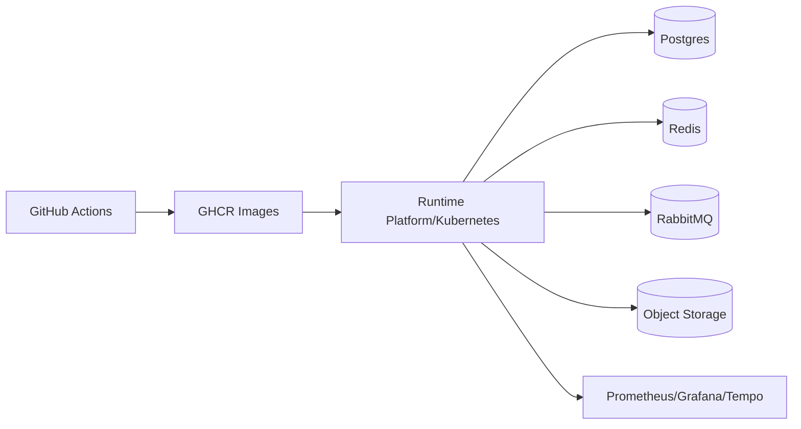

# DevOps Architecture

## Local Services
`docker-compose.yml` provides nginx, PostgreSQL/pgvector, Redis, MinIO, MailHog, RabbitMQ, Prometheus, Grafana, Tempo, Loki/Promtail-related config, Alertmanager, and backup tooling.

## CI/CD Workflows
- `ci.yml`: backend verify, frontend build, secret scan.
- `docker-publish.yml`: backend and frontend GHCR image build/push plus Trivy image scan.
- `security-nightly.yml`: OWASP Dependency Check and Trivy scans.
- `openapi-publish.yml`: boots backend and publishes OpenAPI artifact.
- `deploy.yml`: deployment flow.
- `dr-drill.yml`: disaster recovery drill.

## Deployment Diagram

