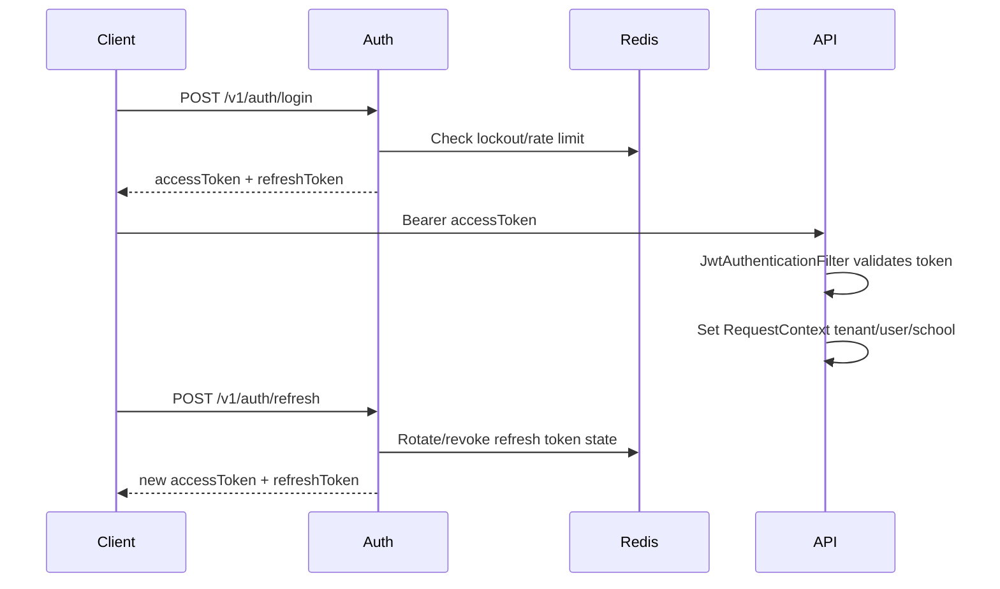

# JWT Flow

## Rules
- Access token identity is authoritative for tenant context.
- Refresh token rotation must preserve security against replay.
- Logout must denylist/revoke usable tokens where supported.
- Token parsing errors return JSON 401, not HTML.
