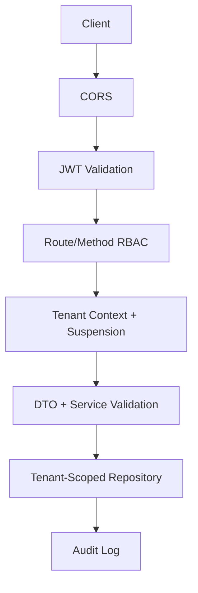

# Security Architecture

## Controls
- Stateless JWT auth with Spring Security.
- BCrypt password hashing.
- Redis-backed login lockout, JWT denylist, OTP, and rate limiting.
- Route and method RBAC.
- Tenant suspension filter.
- CORS allow-patterns for local dev and CloudCampus domains.
- Central JSON auth entry point and exception handler.
- Secret scan, OWASP dependency scan, and Trivy image scan in GitHub Actions.

## Defense In Depth

