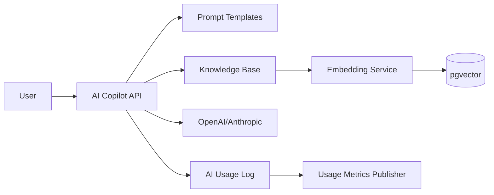

# AI Architecture

CloudCampus AI is implemented under the `ai` backend package with Spring AI integrations.

## Components
- School admin AI copilot.
- Prompt templates and prompt detail management.
- Knowledge base documents.
- Embedding service and pgvector vector store.
- AI usage logs and metrics publisher.
- AI rate limiter.

