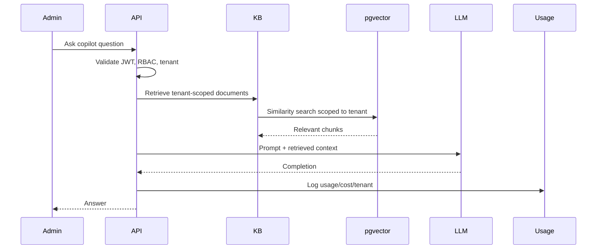

# RAG Flow

```mermaid
sequenceDiagram
  participant Admin
  participant API
  participant KB
  participant Vector as pgvector
  participant LLM
  participant Usage

  Admin->>API: Ask copilot question
  API->>API: Validate JWT, RBAC, tenant
  API->>KB: Retrieve tenant-scoped documents
  KB->>Vector: Similarity search scoped to tenant
  Vector-->>KB: Relevant chunks
  API->>LLM: Prompt + retrieved context
  LLM-->>API: Completion
  API->>Usage: Log usage/cost/tenant
  API-->>Admin: Answer
```

## Rule
RAG retrieval must never query global or other-tenant vectors unless the document is explicitly platform-public.
