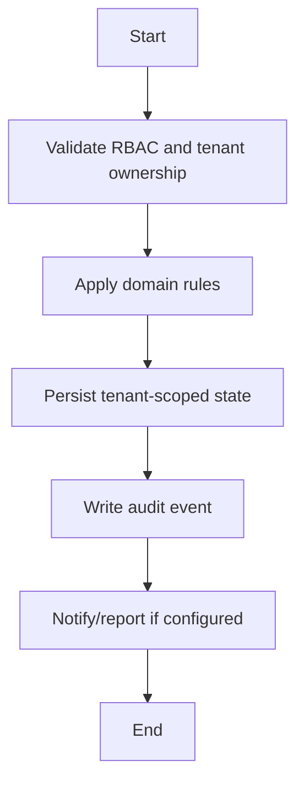

# Admission Workflow

## Flow
1. Create/validate student identity and admission data.
2. Assign tenant, school, academic year, class, section.
3. Create parent links and optional documents.
4. Initialize Profile 360 records where needed.
5. Audit admission mutation.

## Required Guards
- Validate role and tenant ownership before mutation.
- Preserve historical records for lifecycle, finance, academic, and audit data.
- Emit audit log for each business-state mutation.

## Mermaid

