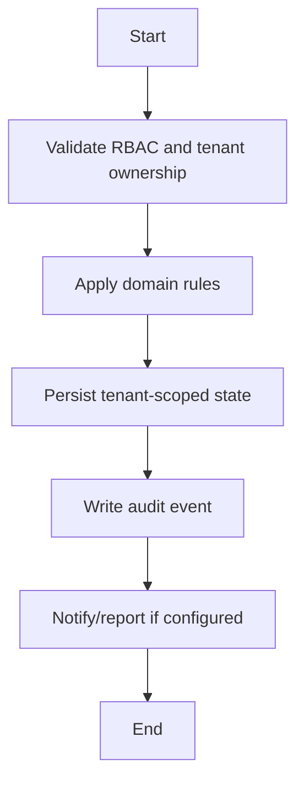

# Attendance Workflow

## Flow
1. Create attendance session for class/date.
2. Mark students present/absent/late.
3. Persist attendance records tenant-scoped.
4. Queue absence notifications to parents.
5. Expose reports to admin/student/parent roles.

## Required Guards
- Validate role and tenant ownership before mutation.
- Preserve historical records for lifecycle, finance, academic, and audit data.
- Emit audit log for each business-state mutation.

## Mermaid

