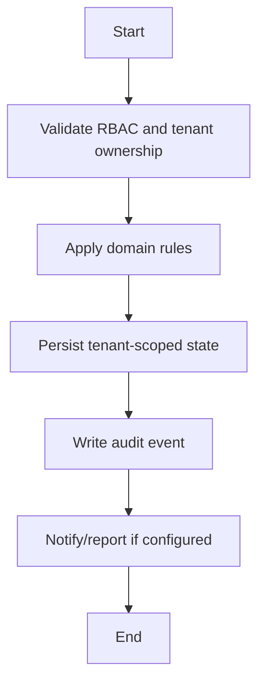

# Exam Workflow

## Flow
1. Create exam and subject entries.
2. Enter marks for enrolled students.
3. Calculate/publish results.
4. Generate report cards.
5. Expose student/parent result views.

## Required Guards
- Validate role and tenant ownership before mutation.
- Preserve historical records for lifecycle, finance, academic, and audit data.
- Emit audit log for each business-state mutation.

## Mermaid

