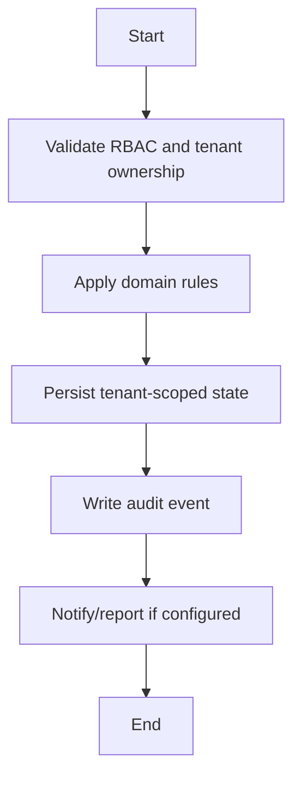

# Fee Workflow

## Flow
1. Create categories and structures.
2. Assign fee records to students.
3. Collect offline payments or create gateway order.
4. Verify payment/webhook idempotently.
5. Generate receipt/invoice and audit.

## Required Guards
- Validate role and tenant ownership before mutation.
- Preserve historical records for lifecycle, finance, academic, and audit data.
- Emit audit log for each business-state mutation.

## Mermaid

