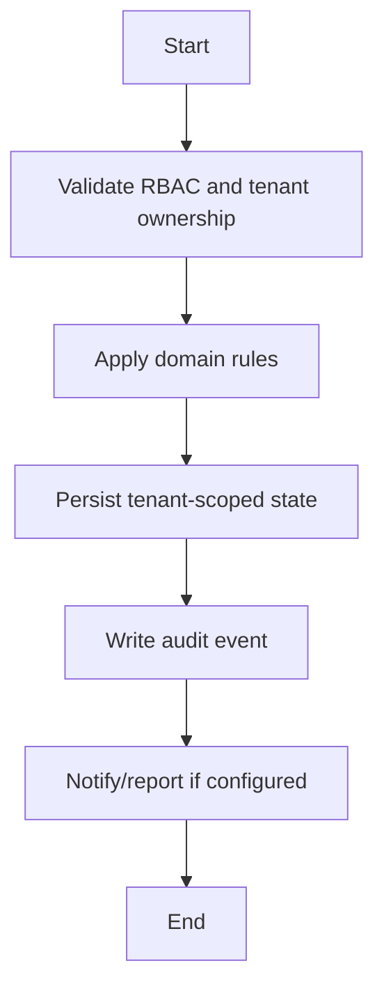

# Hostel Workflow

## Flow
1. Current state: no standalone hostel module.
2. Hostel name, room number, and warden contact live in Student Profile 360 logistics fields.
3. Future module should add hostel blocks, rooms, beds, wardens, allocation history, attendance, and audit.

## Required Guards
- Validate role and tenant ownership before mutation.
- Preserve historical records for lifecycle, finance, academic, and audit data.
- Emit audit log for each business-state mutation.

## Mermaid

