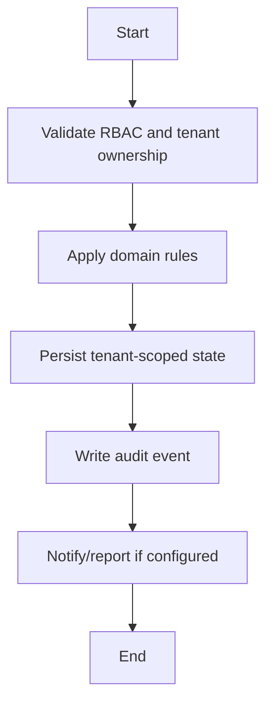

# Promotion Workflow

## Flow
1. Select source academic year/class/section.
2. Preview eligible students.
3. Create new academic placement records.
4. Preserve previous academic history.
5. Audit promotion operation.

## Required Guards
- Validate role and tenant ownership before mutation.
- Preserve historical records for lifecycle, finance, academic, and audit data.
- Emit audit log for each business-state mutation.

## Mermaid

