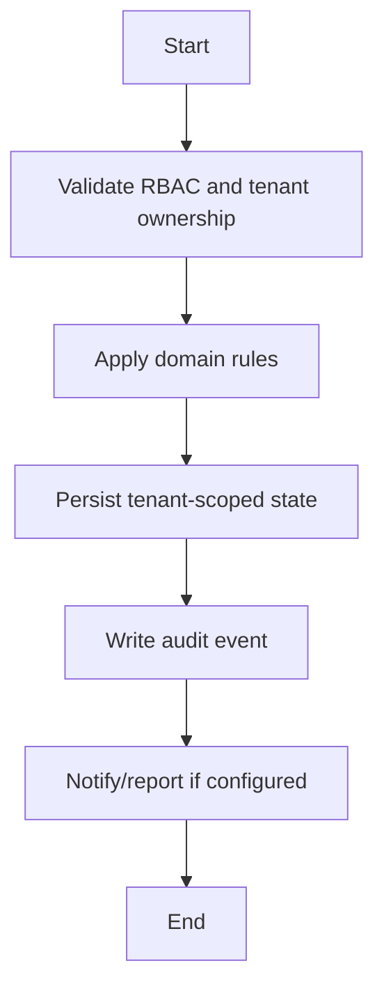

# Rejoin Workflow

## Flow
1. Locate inactive/transferred/suspended student.
2. Validate rejoin eligibility.
3. Create new active placement without overwriting old data.
4. Restore access where appropriate.
5. Audit rejoin.

## Required Guards
- Validate role and tenant ownership before mutation.
- Preserve historical records for lifecycle, finance, academic, and audit data.
- Emit audit log for each business-state mutation.

## Mermaid

