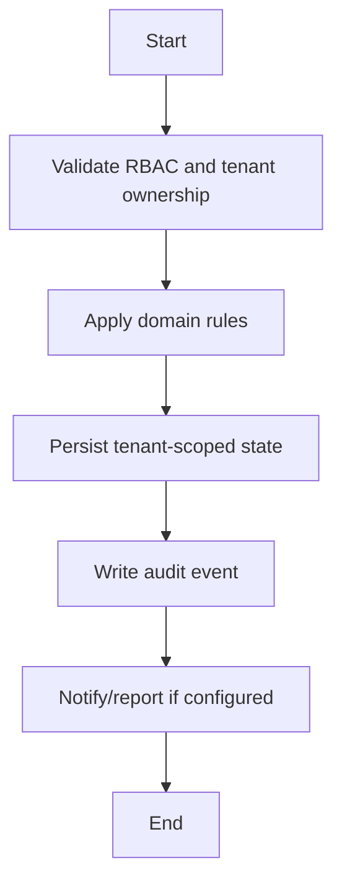

# Suspension Workflow

## Flow
1. Validate authority and reason.
2. Change current access/operational status.
3. Preserve historical records.
4. Notify relevant roles if implemented.
5. Audit suspension and later reinstatement.

## Required Guards
- Validate role and tenant ownership before mutation.
- Preserve historical records for lifecycle, finance, academic, and audit data.
- Emit audit log for each business-state mutation.

## Mermaid

