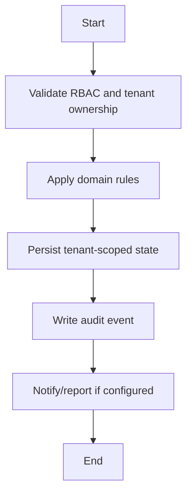

# Transfer Workflow

## Flow
1. Validate source student and destination school/class context.
2. Close active placement safely.
3. Create transfer record/history.
4. Preserve fees/exams/attendance as historical data.
5. Audit transfer.

## Required Guards
- Validate role and tenant ownership before mutation.
- Preserve historical records for lifecycle, finance, academic, and audit data.
- Emit audit log for each business-state mutation.

## Mermaid

