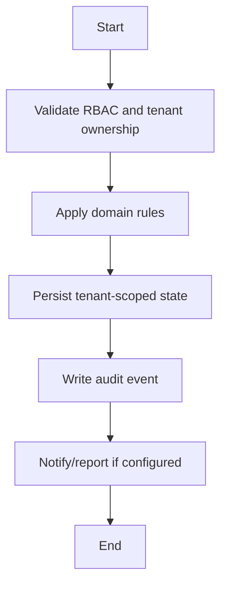

# Transport Workflow

## Flow
1. Current state: no standalone transport module.
2. Transport mode, route, pickup, and drop data live in Student Profile 360 logistics fields.
3. Future module should add routes, vehicles, stops, driver/attendant, allocation history, and audit.

## Required Guards
- Validate role and tenant ownership before mutation.
- Preserve historical records for lifecycle, finance, academic, and audit data.
- Emit audit log for each business-state mutation.

## Mermaid

