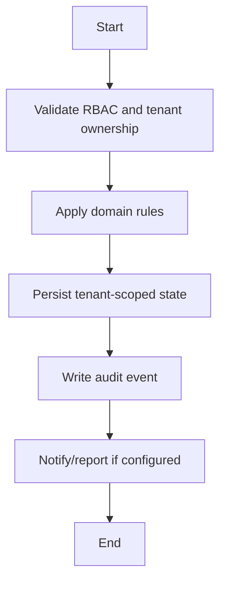

# Website Builder Workflow

## Flow
1. Load or create tenant school website.
2. Create pages, sections, and nav items.
3. Validate slug/schema/domain ownership.
4. Publish content and record audit timeline.
5. Expose published public site by tenant code/domain.

## Required Guards
- Validate role and tenant ownership before mutation.
- Preserve historical records for lifecycle, finance, academic, and audit data.
- Emit audit log for each business-state mutation.

## Mermaid

